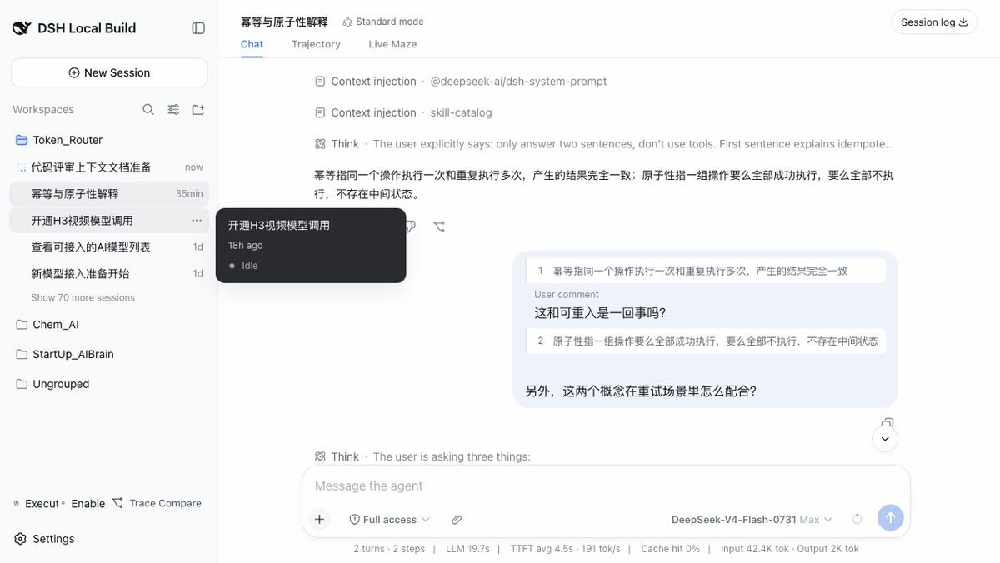

# DSH Codex Experience

简体中文 | [English](README.en.md)



这是面向 [DeepSeek Harness](https://github.com/deepseek-ai/deepseek-harness) 的社区增强包，提供 Codex 风格的回答注释、临时侧边对话和 Todo 状态新鲜度约束——以**社区插件加两个小核心补丁**的形式发布。DeepSeek Harness 目前还没有暴露注释体验所需的两个转录扩展点，所以本仓库在插件源码之外，附带一份针对上游 `master` 的干净补丁（见 `patches/`）。等上游提供等价的扩展点后，补丁退役，这里就变回一个纯插件仓库。

## 包结构

| 包 | 作用 |
| --- | --- |
| [`dsh-codex-conversation`](packages/codex-conversation) | 选中 assistant 回答、暂存多条注释、跳回原回答，并在详情栏中进行临时侧边对话。 |
| [`dsh-todo-freshness-guard`](packages/todo-freshness-guard) | 当未完成的 `todo_write` 长时间未更新时提醒 Agent，随后阻止普通工具，直到完整任务列表被重新同步。 |
| [`dsh-codex-pack`](packages/codex-pack) | 使用推荐默认值一次安装前两个插件。 |

两个功能包彼此独立：Web 对话插件不依赖 Guard，Guard 也不依赖 Web UI。

## 兼容范围

- DeepSeek Harness：`master`（rc.8 系）+ `patches/0001-transcript-extension-seams.patch`
- Node.js：`^22.19.0 || >=24.0.0`
- 当前状态：社区预览版

DeepSeek Harness 仍处于开发者预览阶段，插件接口可能发生破坏性变化。插件源码依赖宿主的三项能力：临时侧边会话 fork、`conversation.chat.user-body` 气泡链、以及 `chatInlineDirectives` 正文指令词汇。后两项由随附补丁提供——针对上游 `master` 共 293 行纯新增改动，两个被改包的上游测试套件全量验证通过。在没有这两个转录接缝的 harness 上，注释特性只降级显示为字面文本：发出的消息格式完全一致，已有会话在打过补丁的 harness 上打开时会原地升级（机制见 `packages/codex-conversation/src/client/harness-compat.ts`）。已发布的 `0.1.0-rc.6` npm 包整体早于侧边会话 API，本仓库无法在其上编译。之后的 npm 版本同样不提供这些接口（2026-09-28 实测 `0.1.5-rc.3` 与 `0.1.7-rc.2`）：两者都没有临时侧边会话接口、选区浮层插槽和详情栏插槽，所以对话插件在 npm 宿主上不可用。具体表现是：`0.1.5-rc.3` 上侧边对话按钮能显示，但一点击就报错；`0.1.7-rc.2` 上按钮因图标改名在渲染时就崩溃（宿主会隔离这个插槽，页面其他部分照常）。Todo Guard 不依赖这些接口，可以单独装在 npm 的 `0.1.0-rc.6` 至 `0.1.7-rc.2` 上。

## 应用核心补丁

```sh
git clone https://github.com/deepseek-ai/deepseek-harness.git
cd deepseek-harness
git apply --3way path/to/dsh-codex-experience/patches/0001-transcript-extension-seams.patch
pnpm install && pnpm build
```

补丁只添加两个通用扩展点并自带测试，全程不涉及"注释"概念。向上游提议收编这两个接缝的提案见 DeepSeek Harness 的 GitHub Discussions。

## 从 GitHub 工作副本安装

在 npm 包正式发布前，从构建后的工作副本安装到 DSH Profile：

```sh
git clone https://github.com/lamost423/dsh-codex-experience.git
cd dsh-codex-experience
corepack enable
pnpm install --frozen-lockfile
pnpm build
dsh plugin --profile web add ./packages/codex-pack
dsh web
```

只安装一个能力时，把 `./packages/codex-pack` 换成 `./packages/codex-conversation` 或 `./packages/todo-freshness-guard`。

检查最终插件树：

```sh
dsh web --dump-config
```

移除组合增强包：

```sh
dsh plugin --profile web remove dsh-codex-pack
```

## 注释与侧边对话流程

1. 选中 assistant 回答中的文字。
2. 点击“添加到对话”暂存注释，或点击“在侧边聊天中提问”打开临时子对话。
3. 可以填写当前注释的问题，并继续选中其他内容添加多条注释。
4. 最后统一提交主输入框。模型会收到明确的原回复链接、引用内容、注释问题和主输入框补充问题。

侧边对话通过父 Session 的临时 fork 创建，固定显示在当前任务的详情栏，不会切换主 Session；关闭面板后临时子 Session 会被销毁。

## Todo 新鲜度约束

存在未完成的 `todo_write` 列表后，默认策略为：

```yaml
reminderAfterCalls: 5
blockAfterCalls: 8
```

原生工具调用和 Code Mode 子调用共用计数器。`todo_write` 始终可用；外层 `run_code` 也保持可用，保证 Code Mode 仍能调用 `todo_write`。

需要修改阈值时，在更高优先级的 Profile Patch 中覆盖 Guard 配置。

## 开发与验证

```sh
pnpm install
pnpm check
pnpm pack:all
```

`pnpm check` 会执行 TypeScript 校验、单元及组件测试和生产构建。生成的 tarball 位于 `artifacts/`。

## 来源与许可证

初始实现基于 DeepSeek Harness 开发，随后抽取为仓库外插件。衍生代码继续遵守上游 MIT 许可证，详见 [`NOTICE`](NOTICE) 和 [`LICENSE`](LICENSE)。
